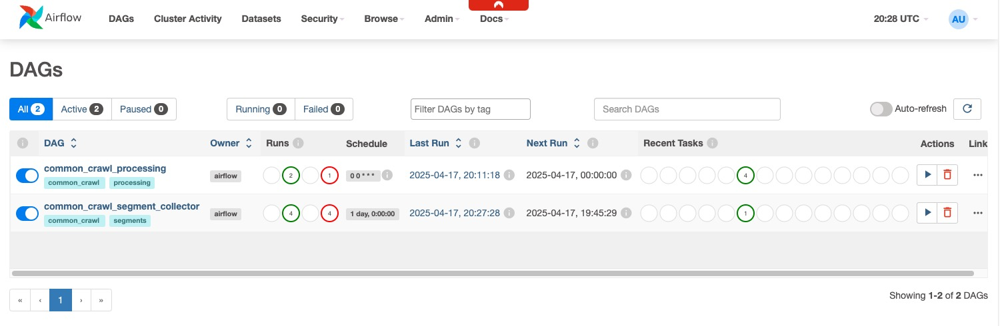
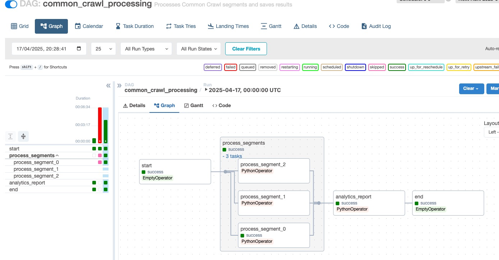
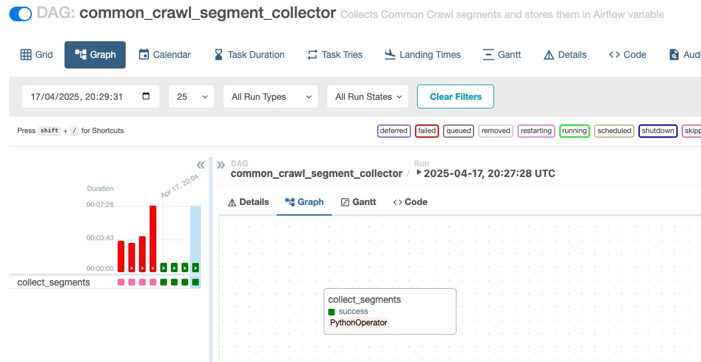

# Common Crawl Data Processing Pipeline

This project processes Common Crawl WAT files to extract and analyze website metrics, storing results in PostgreSQL.

## Quick Start

### Requirements

- Python 3.8+
- Apache Airflow 2.7.0+
- PostgreSQL 13+
- Docker and Docker Compose

### Prerequisites

- Docker
- Docker Compose
- Make
- Git

For a completely automated setup, run the following manually :

1. Create a Python virtual environment:
```bash
python -m venv venv
source venv/bin/activate  # On Windows: venv\Scripts\activate
```

2. Install dependencies:
```bash
pip install -r requirements.txt
pip install -r requirements-airflow.txt
```

3. Set up the project structure:
```bash
make setup
```

4. Build and start the services:
```bash
make build
make up
```

5. Initialize Airflow:
```bash
make init-airflow
make setup-airflow
```

6. Access the Airflow web interface at `http://localhost:8080`
   - Username: admin
   - Password: admin


7. Running DAGs

Run the DAGs in the following order:

- common_crawl_segment_collector
- common_crawl_processing







## Project Structure

```
.
├── data/                      # Data storage directory
│   ├── raw/                   # Raw WAT files
│   ├── processed/             # Processed data files
│   └── reports/               # Analytics reports
├── dags/                      # Airflow DAG definitions
│   ├── common_crawl_processing.py      # Main processing DAG
│   └── common_crawl_segment_collector.py # Segment collection DAG
├── docker/                    # Docker-related files
├── img/                       # Project images and diagrams
├── logs/                      # Application logs
├── plugins/                   # Airflow custom plugins
├── src/                       # Source code
│   ├── data_processor.py      # Data processing core functionality
│   ├── wat_processor.py       # WAT file processing
│   ├── metrics_processor.py   # Metrics computation
│   ├── website_categorizer.py # Website categorization
│   ├── process_wat.py         # WAT processing utilities
│   ├── compute_metrics.py     # Metrics computation utilities
│   └── main.py               # Main application entry point
├── tests/                     # Test files
├── .gitignore                # Git ignore rules
├── Dockerfile                # Docker image definition
├── docker-compose.yml        # Docker services configuration
├── init_airflow.py           # Airflow initialization script
├── init_db.sql               # Database initialization SQL
├── Makefile                  # Build and deployment commands
├── requirements.txt          # Python dependencies
└── requirements-airflow.txt  # Airflow-specific dependencies
```

### Key Components

- **DAGs**: Contains Airflow workflow definitions for data processing and segment collection
- **Source Code**: Core functionality for data processing, metrics computation, and website categorization
- **Data Directory**: Organized storage for raw data, processed files, and reports
- **Docker**: Containerization configuration for consistent deployment
- **Tests**: Test files for ensuring code quality and functionality
- **Configuration**: Various configuration files for database, Airflow, and dependencies

## Features

1. Downloads and processes WAT files from Common Crawl
2. Extracts external links from web pages
3. Categorizes websites based on content
4.Stores results in PostgreSQL and Parquet format

## Data Processing

The pipeline:
1. Downloads WAT files from Common Crawl
2. Extracts external links and metadata
3.Categorizes websites
4. Saves results to PostgreSQL and Parquet

## Development

Run tests:
```bash
python -m pytest tests/
```

## Data Storage

- PostgreSQL: Raw extracted links and metadata
- Parquet: Final processed data, partitioned by source domain

# Cleanup

When you're done working with the project, you can clean up resources using the provided Make targets:

## Basic Cleanup

```bash
# Stop all services
make down

# Clean up data and containers
make clean
```

## Comprehensive Cleanup

For a more thorough cleanup that includes Docker images:

```bash
# Clean up everything (containers, volumes, images, data)
make clean-all
```

## Data-Only Cleanup

If you only want to clean up data files without affecting containers:

```bash
# Clean up only data files
make clean-data
```

## Virtual Environment Cleanup

To remove the Python virtual environment:

```bash
# Remove Python virtual environment
make clean-venv
```
